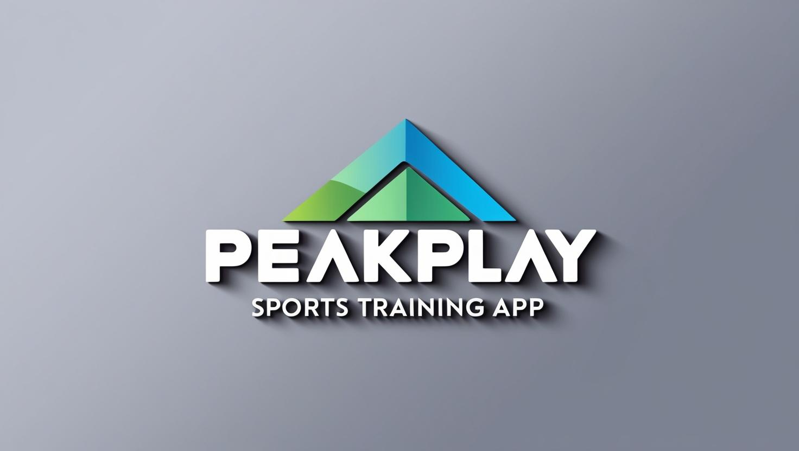

# Peak Play Sports

**Achieve your peak performance with AI-powered insights!**  
Peak Play Sports uses CrewAI agents to help athletes optimize their training, track progress, and reach their **peak performance!**

## 🚀 Features

- **Personalized Training Plans:** Tailored workout routines based on player performance and goals.  
- **Performance Analysis:** AI-driven insights to improve technique and strategy.  
- **Progress Tracking:** Monitor metrics over time to visualize improvement.  
- **Intelligent Coaching:** Virtual agents offer real-time feedback and recommendations.

## 🛠️ Tech Stack

- **Frontend:** WordPress
- **Backend:** Python/FastAPI, PHP
- **AI Agents:** CrewAI

## Installation (Ubuntu 24.04 including WSL)
### Install uv and venv

https://docs.astral.sh/uv/#installation

```bash
curl -LsSf https://astral.sh/uv/install.sh | sh
```

```bash
uv venv --python 3.10 
```

Activate the environment

```bash
source .venv/bin/activate
```

### Install Python requirements.txt

```bash
uv pip install -r requirements.txt
```
